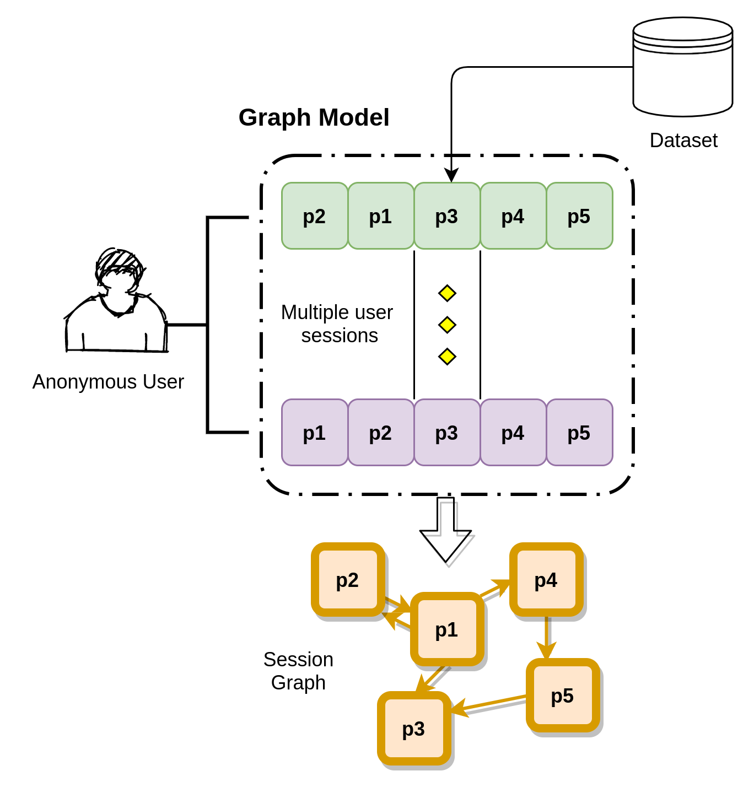
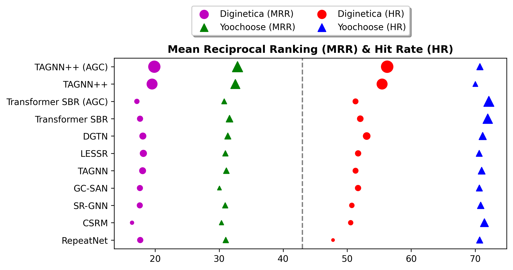

<div align="center">

<samp>
     
# Improved Representation Learning for Session-based Recommendation ([arXiv](https://arxiv.org/abs/2107.01516))

| **[ [```Model Architecture```](<assets/TAGNN++.png>) ]** | **[ [```Task```](<assets/SBR_Task.png>) ]** | **[ [```Paper```](<https://drive.google.com/file/d/1usXlOaP6CPw5EZj0xqSM0lzs69xqvxYv/view?usp=sharing>) ]** | **[ [```arXiv```](<https://arxiv.org/abs/2107.01516>) ]** 
|:-------------------:|:-------------------:|:-------------------:|:-------------------:|

     
PyTorch implementation of the model TAGNN++, presented in the paper "Improved Representation Learning for Session-based Recommendation"
 
     
---
   
</div>  
     
</samp> 
   
     
<samp>
     
#### Usage     
     
```bash
python3 train.py [-h] [--dataset DATASET] [--defaults DEFAULTS] [--batchSize BATCHSIZE]
               [--hiddenSize HIDDENSIZE] [--nhead NHEAD] [--layer LAYER]
               [--feedforward FEEDFORWARD] [--epoch EPOCH] [--lr LR]
               [--lr_dc LR_DC] [--lr_dc_step LR_DC_STEP] [--l2 L2]
               [--patience PATIENCE] [--validation] 
               [--valid_portion VALID_PORTION]

Arguments:
  -h, --help            Description and Help Message
  --dataset DATASET     Name of the Dataset:
                        diginetica | yoochoose1_64
  --defaults DEFAULTS   Use default configuration   
  --batchSize BATCHSIZE
                        Batch size
  --hiddenSize HIDDENSIZE
                        Hidden state dimensions
  --epoch EPOCH         The number of epochs to train
  --lr LR               Set the Learning Rate
  --lr_dc LR_DC         Set the decay rate used with Learning rate
  --lr_dc_step LR_DC_STEP
                        Steps in Learning rate decay
  --l2 L2               Assign L2 Penalty
  --patience PATIENCE   Early stopping criterion
  --validation          validation
  --valid_portion VALID_PORTION
                        Portion of train-set to split into val-set
```     
---     
     
#### Dependencies

   
     
This code was developed with ```python3.6```
```
Python (3.6.x)
PyTorch (1.7.x)
CUDA (10.2)
cuDNN (7.6.5)
networkx (2.5.1)
numpy (1.19.5)     
```
For original source of AGC, for further tweaks:
     
```
git clone https://github.com/vballoli/nfnets-pytorch.git   
```        
     
<div align="center">
     
# Problem Statement Formulation


  
<!-- ---     
     
# Results


  
--- -->
     
For further details, contact **Sai Mitheran** via [Linkedin](https://www.linkedin.com/in/sai-mitheran-4b9422187/), or via email by clicking the icon below.  

<a href="mailto:saimitheran06@gmail.com?"></a>     
     
  </samp>  
  
  </div>  
   
---     
     
### Reference
     
To cite our paper:

```bibtex
@article{mitheran2021mproved,
    title={Improved Representation Learning for Session-based Recommendation},
    author={Sai Mitheran and Abhinav Java and Surya Kant Sahu and Arshad Shaikh},
    year={2021},
    journal={arXiv preprint arXiv:2107.01516}
}
```

---

